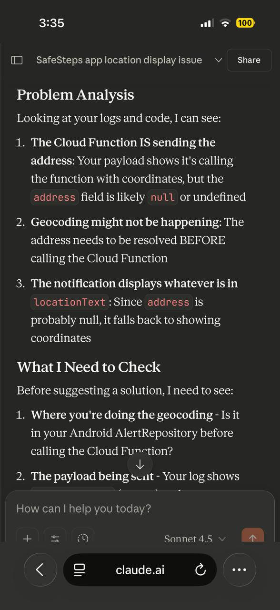
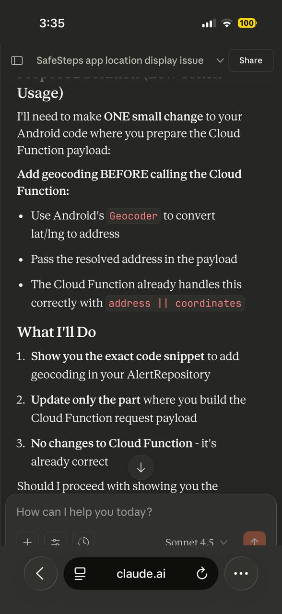

## AI write-up 

### Image (Icon) 

As stated in the previous submission of our project for part 1 and 2, AI was used to generate the main image we use as a logo. AI was given the general idea of what to create i.e. must be in the shape of a shield to represent the safety of our application provides and then it must also show someone walking, which is simple yet emphasizes that the application is used on the go, anywhere. No new images were generated by AI in this part of the submission, but it is important to note that it was used previously.

As you can see from the images, AI was used. For the user Interface and user experience AI did an inspection to identify things like inconsistent header styles, deprecated code for navigation bars, and poor visual feedback on the buttons. It then organized these fixes which was helpful for ensuring no critical design flaws were missed.

Ran through a bug where the alert system was only sending coordinates instead of actual addresses, AI was useful here as well because it pointed out that the application was missing a step called geocoding before sending the alert. It then provided a detailed proposal of the methods in the code that needed to be updated in order to fix the issue.
