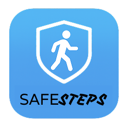
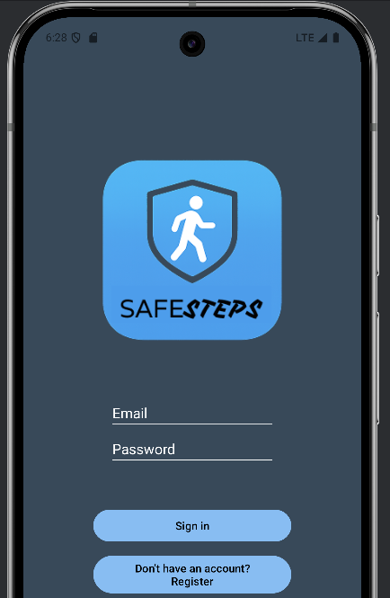
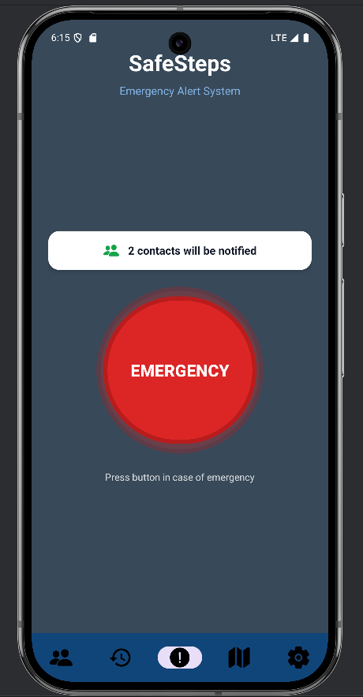
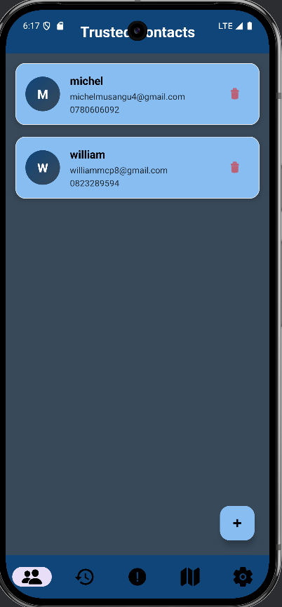
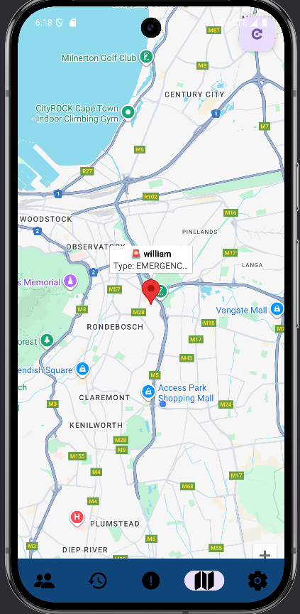
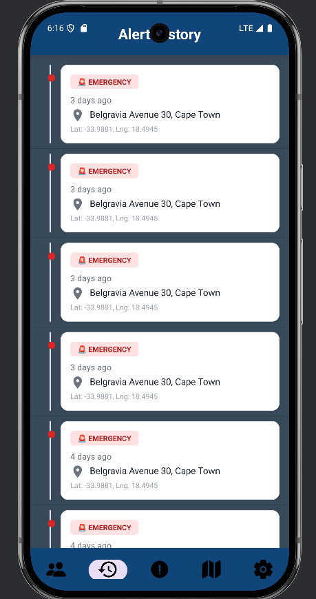
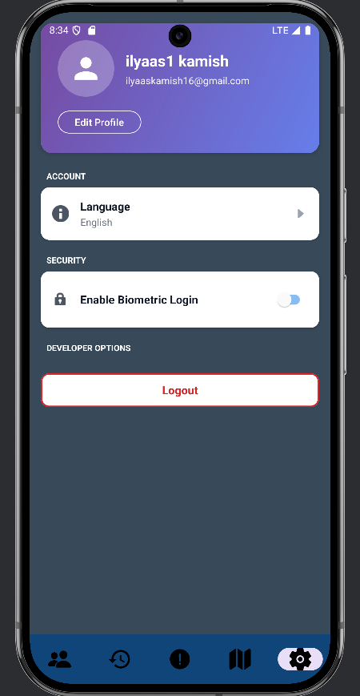
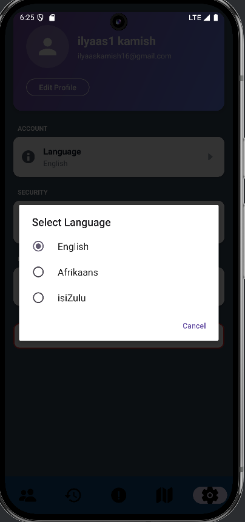

# SafeSteps 🚨

**Emergency Alert & Safety Tracking Application**

SafeSteps is a comprehensive mobile safety application built with Kotlin and Firebase that enables users to send emergency alerts to trusted contacts, track locations in real-time, and maintain safety awareness through geofencing and notifications.



---

## 📱 Features

### Core Functionality
- ✅ **Single Sign-On (SSO) Authentication** - Secure Firebase Authentication
- ✅ **Biometric Login** - Fingerprint/Face recognition for quick secure access
- ✅ **Emergency Alert System** - One-tap SOS button to notify all trusted contacts
- ✅ **Trusted Contacts Management** - Add, view, and manage emergency contacts
- ✅ **Real-time Location Tracking** - GPS-based location sharing during emergencies
- ✅ **Interactive Map View** - View active alerts from your trusted contacts on Google Maps
- ✅ **Alert History** - Timeline view of all past emergency alerts with geocoded addresses
- ✅ **Push Notifications** - Real-time FCM notifications when contacts need help
- ✅ **Offline Mode with Sync** - Continue using the app offline, syncs when reconnected
- ✅ **Multi-language Support** - English, Afrikaans, and isiZulu

### Technical Features
- 🔐 Firebase Authentication with email/password
- 📍 Google Maps integration for location tracking
- 🗄️ Firebase Firestore for real-time data sync
- 💾 Room Database for offline data persistence
- 🔔 Firebase Cloud Messaging for push notifications
- 🌍 Geocoding for human-readable addresses
- 🔄 Background sync with WorkManager
- 🏗️ MVVM Architecture with ViewModels and LiveData
- ⚡ Kotlin Coroutines for asynchronous operations

---

## 📸 Screenshots

| Login | Emergency Alert | Trusted Contacts | Map View |
|-------|----------------|------------------|----------|
|  |  |  |  |

| Alert History | Settings | Multi-language | Biometric |
|---------------|----------|----------------|-----------|
|  |  |  |  |

---

## 🏗️ Architecture

SafeSteps follows the **MVVM (Model-View-ViewModel)** architecture pattern:

```
app/
├── models/          # Data classes (EmergencyAlert, TrustedContact, User)
├── repository/      # Data layer (Firebase, Room DB operations)
├── viewmodels/      # Business logic (AlertViewModel, ContactViewModel, MapViewModel)
├── database/        # Room Database (local caching)
├── notifications/   # FCM push notifications
├── sync/           # Offline sync manager
└── utils/          # Helper classes (DateFormatter, etc.)
```

**Key Components:**
- **Firebase Firestore**: Cloud database for alerts, contacts, and user data
- **Room Database**: Local SQLite database for offline functionality
- **Firebase Cloud Messaging**: Push notifications via Cloud Functions
- **Google Maps API**: Location visualization and navigation
- **WorkManager**: Background sync when network is restored

---

## 🚀 Getting Started

### Prerequisites
- Android Studio Hedgehog (2023.1.1) or later
- Android SDK 31 (minimum) to 36 (target)
- JDK 17 or later
- Firebase account
- Google Maps API key

### Firebase Setup

1. **Create Firebase Project**
   - Go to [Firebase Console](https://console.firebase.google.com/)
   - Create a new project named "SafeSteps"
   - Add an Android app with package name: `com.fake.safesteps`

2. **Download Configuration**
   - Download `google-services.json`
   - Place it in `app/` directory (already included in project)

3. **Enable Firebase Services**
   - **Authentication**: Enable Email/Password provider
   - **Firestore Database**: Create database in production mode
   - **Cloud Messaging**: Enable FCM for push notifications
   - **Cloud Functions**: Deploy the notification function (see below)

4. **Deploy Cloud Function** (Required for notifications)
   ```bash
   cd functions
   npm install
   firebase deploy --only functions
   ```
   
   The function URL will be: `https://us-central1-safesteps-1cd09.cloudfunctions.net/sendNotification`

### Google Maps Setup

1. **Get API Key**
   - Go to [Google Cloud Console](https://console.cloud.google.com/)
   - Enable Maps SDK for Android
   - Create API key with Android restrictions

2. **Add API Key**
   - Open `app/src/main/AndroidManifest.xml`
   - Replace the placeholder API key:
   ```xml
   <meta-data
       android:name="com.google.android.geo.API_KEY"
       android:value="YOUR_GOOGLE_MAPS_API_KEY_HERE" />
   ```

### Installation

1. **Clone the Repository**
   ```bash
   git clone https://github.com/yourusername/SafeSteps.git
   cd SafeSteps
   ```

2. **Open in Android Studio**
   - Open Android Studio
   - Select "Open an Existing Project"
   - Navigate to the cloned repository
   - Wait for Gradle sync to complete

3. **Configure API Keys**
   - Add `google-services.json` to `app/` directory
   - Update Google Maps API key in `AndroidManifest.xml`
   - Update Cloud Function URL in `AlertRepository.kt` if different

4. **Build and Run**
   - Connect Android device or start emulator (API 31+)
   - Click "Run" or press Shift+F10
   - App will install and launch on device

---

## 🧪 Testing

### Unit Tests
```bash
./gradlew test
```

### Instrumented Tests
```bash
./gradlew connectedAndroidTest
```

### GitHub Actions
- Automated testing runs on every push to `release/**` branches
- Builds debug and release APKs
- Generates APK and AAB artifacts
- View workflow: `.github/workflows/generate-apk-aab-debug-release.yml`


---

## 📦 Building Release APK

### Generate Keystore (First Time Only)
```bash
keytool -genkey -v -keystore safesteps.keystore -alias safesteps -keyalg RSA -keysize 2048 -validity 10000
```

### Build Signed APK
1. **Via Android Studio**
   - Build → Generate Signed Bundle / APK
   - Select APK
   - Create or select keystore
   - Build release variant

2. **Via Command Line**
   ```bash
   ./gradlew assembleRelease
   ```
   APK location: `app/build/outputs/apk/release/app-release.apk`


---

## 📱 Google Play Store Preparation

### Required Assets
- **App Icon**: 512x512px (already included)
- **Feature Graphic**: 1024x500px
- **Screenshots**: 
  - Phone: 16:9 ratio (1920x1080px minimum)
  - Tablet: 16:10 ratio (2560x1600px minimum)
  - Minimum 4 screenshots required
- **Short Description**: Maximum 80 characters
- **Full Description**: Maximum 4000 characters
- **Privacy Policy**: Required URL

### Pre-launch Checklist
- [ ] All permissions properly declared and explained
- [ ] Privacy policy created and hosted
- [ ] Content rating questionnaire completed
- [ ] Target audience and age rating set
- [ ] Signed APK/AAB uploaded
- [ ] Store listing translations (optional)

---

## 🔐 Permissions

```xml
<!-- Essential Permissions -->
<uses-permission android:name="android.permission.INTERNET" />
<uses-permission android:name="android.permission.ACCESS_FINE_LOCATION" />
<uses-permission android:name="android.permission.ACCESS_COARSE_LOCATION" />
<uses-permission android:name="android.permission.POST_NOTIFICATIONS" />
<uses-permission android:name="android.permission.USE_BIOMETRIC" />
<uses-permission android:name="android.permission.ACCESS_NETWORK_STATE" />
```

**Why we need these:**
- **INTERNET**: Firebase and API communication
- **LOCATION**: Emergency alert location tracking
- **NOTIFICATIONS**: Real-time emergency alerts
- **BIOMETRIC**: Fingerprint/face authentication
- **NETWORK_STATE**: Offline mode detection

---

## 🌐 Multi-language Support

SafeSteps supports three languages:
- **English** (default)
- **Afrikaans** (`values-af/`)
- **isiZulu** (`values-zu/`)

Users can switch languages in Settings → Language

---

## 🎥 Video Demonstration

Watch the full app demonstration: [YouTube Link - ADD YOUR LINK HERE]


---

## 📝 Release Notes

See [RELEASE_NOTES.md](RELEASE_NOTES.md) for complete changelog and new features since prototype.

---

## 🤖 AI Usage Declaration

This project utilized AI assistance for:
- Code generation and debugging (GitHub Copilot, Claude AI)
- API integration guidance
- UI/UX design suggestions
- Documentation drafting

See [AI_USAGE.md](AI_USAGE.md) for detailed AI usage documentation.

---

## 👥 Team Members

- **[ilyaas kamish]** - Lead Developer
- **[William Mcpetrie]** - [Role]
- **[Michel ]** - [Role]
- **[Nomvuselelo ]** - [Role]

---

## 📚 Dependencies

### Core
- Kotlin 2.0.21
- Android Gradle Plugin 8.7.3
- Minimum SDK: 31 (Android 12)
- Target SDK: 36 (Android 14)

### Firebase
- Firebase BOM 33.4.0
- Firebase Authentication
- Firebase Firestore
- Firebase Cloud Messaging

### Google Services
- Google Maps 18.2.0
- Google Location Services 21.1.0
- Google Play Services Auth 20.7.0

### Jetpack
- Room Database 2.6.1
- WorkManager 2.9.0
- Lifecycle Components 2.6.2
- Biometric 1.1.0
- SwipeRefreshLayout 1.1.0

### Coroutines
- Kotlinx Coroutines 1.7.3

---

## 🐛 Known Issues

- **Issue #1**: Location updates may be delayed in battery saver mode
- **Workaround**: Disable battery optimization for SafeSteps in device settings

- **Issue #2**: Map markers may not appear immediately after granting location permission
- **Workaround**: Refresh the map screen by navigating away and back

---

## 🔮 Future Enhancements

- [ ] Geofencing support for location-based alerts
- [ ] Voice-activated emergency alerts
- [ ] Integration with local emergency services
- [ ] Group safety check-ins
- [ ] Live location sharing during active alerts
- [ ] Panic button widget for home screen

---

## 📄 License

This project was created as part of the PROG7314 Portfolio of Evidence at The Independent Institute of Education.

© 2025 SafeSteps Team. All rights reserved.

---


## 🙏 Acknowledgments

- **The Independent Institute of Education** - Project requirements and guidance
- **Firebase** - Backend infrastructure
- **Google Maps** - Location services
- **Material Design** - UI/UX guidelines
- **Android Developers** - Documentation and examples

---

## 📊 Project Statistics

- **Lines of Code**: ~5,000+
- **Total Files**: 100+
- **Activities**: 10
- **ViewModels**: 3
- **Repositories**: 6
- **Database Tables**: 3
- **Supported Languages**: 3
- **Minimum Android Version**: Android 12 (API 31)

---

**Last Updated**: January 2025  
**Version**: 1.0.0  
**Status**: Ready for Production ✅
